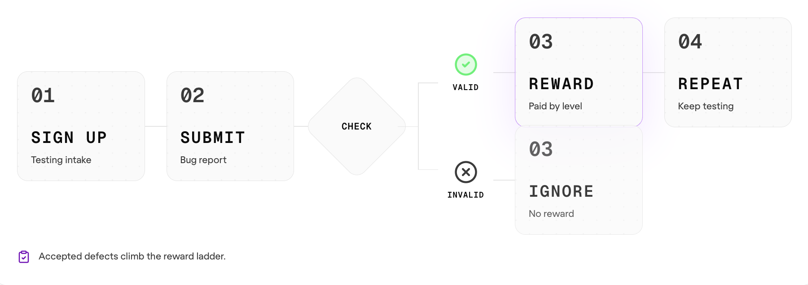

# 0g-testing-hub

**0g-testing-hub** is a community-run testing program for 0G: submit required feedback, test target apps, file reproducible bugs, and climb L0-L3 for 0G Compute Credit. This is **not a code project**: there is no build, test, lint, or package manager here.

## Jump to

- [Quick start](#quick-start)
- [Live links](#live-links)
- [Levels & rewards](#levels--rewards)
- [Where to submit](#where-to-submit)
- [Done means T3](#done-means-t3)
- [Boundaries](#boundaries)
- [Not a defect](#not-a-defect-wont-be-accepted)
- [Test targets](#test-targets)
- [Defect template](#defect-template)
- [Calibration](#calibration)

## Quick start



Follow the flow in the diagram. `Submit bug report` starts after L0; Recruit is the feedback-only entry level.

1. **Sign up** through the current testing intake. **Launch blocker:** add the current intake URL before publishing; do not reuse retired Google Form links.
2. **Clear L0 Recruit** by submitting [0G App Suite Feedback / 0G Studio Feedback](https://forms.gle/ymEdZrdTNs4giEm1A) and [0G Private Computer Feedback](https://forms.gle/G919xrbRyfVJxPZe8). No bug report is required for L0.
3. **Submit** reproducible bugs through the [Defect report form](https://github.com/0gfoundation/0g-testing-hub/issues/new?template=defect-report.yml&labels=defect), one issue per bug.
4. **Check:** triage marks each report valid or invalid.
5. **Reward or ignore:** valid accepted defects climb the reward ladder from L1 upward; invalid reports get no reward.
6. **Repeat** across App Suite, 0G Infra, and Ecosystem dApps until full coverage.

## Live links

| Need | Link |
|------|------|
| Testing intake | _Pending current form URL_ |
| 0G App Suite Feedback / 0G Studio Feedback | [Feedback form](https://forms.gle/ymEdZrdTNs4giEm1A) |
| 0G Private Computer Feedback | [Feedback form](https://forms.gle/G919xrbRyfVJxPZe8) |
| Submit a bug | [Defect report form](https://github.com/0gfoundation/0g-testing-hub/issues/new?template=defect-report.yml&labels=defect) |
| Track issues | [Defect board](https://github.com/orgs/0gfoundation/projects/19) |
| Open repo | [0G Testing Hub](https://github.com/0gfoundation/0g-testing-hub) |
| Understand level rules | [`LEVELS.md`](./LEVELS.md) |
| See Season 1 rewards | [`seasons/2026-apac/rewards.md`](./seasons/2026-apac/rewards.md) |

## Levels & rewards


All rewards are **0G Compute Credit**. No physical goods, no shipping. Payout is the Credit of the **highest level reached**. Full mechanics are in [`LEVELS.md`](./LEVELS.md).

| Lv | Title | How it clears | Credit |
|----|-------|---------------|:------:|
| **L0** | Recruit | Two feedback forms; no bug | **10** |
| **L1** | Tester | 1 accepted · App Suite | **20** |
| **L2** | Infra Pioneer | 2 accepted · App Suite + 0G Infra | **40** |
| **L3** | Master | 5+ accepted · incl. 1 systemic | **100** |

L0 is feedback-only. From L1 upward, rewards climb by **accepted, deduped** defects: more valid bugs unlock higher levels, and Master is the 5+ accepted cap with at least one `systemic` finding. Triage labels decide progression: `status:accepted`, `status:routed`, `area:*`, `systemic`, and shared `rc:*` root-cause codes. See [`.github/TRIAGE.md`](./.github/TRIAGE.md).

> **Acceptance bar:** a defect counts only if it is (a) **reproducible** by someone following your steps, (b) a **divergence from documented/expected behavior** — not market state or your own misconfig, and (c) **measured against the known stack baseline**, not an imagined production target.

## Where to submit

| Module | Bug report | Notes |
|--------|------------|-------|
| **L0 Recruit** | No bug report | Submit [0G App Suite Feedback / 0G Studio Feedback](https://forms.gle/ymEdZrdTNs4giEm1A) + [0G Private Computer Feedback](https://forms.gle/G919xrbRyfVJxPZe8). |
| **0G App Suite** *(core)* | [Defect report form](https://github.com/0gfoundation/0g-testing-hub/issues/new?template=defect-report.yml&labels=defect) | Filed in this Hub. |
| **0G Infra** *(core)* | [Defect report form](https://github.com/0gfoundation/0g-testing-hub/issues/new?template=defect-report.yml&labels=defect) | Filed in this Hub. |
| **Ecosystem dApps** *(record-only)* | dApp's own form / repo | Hub logs coverage only. |

## Done means T3

This applies to bug work after L0. Recruit itself is done after 0G App Suite Feedback / 0G Studio Feedback + 0G Private Computer Feedback.

- **T1 — Coverage:** every in-scope app has a happy path and at least one error path walked.
- **T2 — Defect filed:** every finding is reproducible and filed through the [Defect report form](https://github.com/0gfoundation/0g-testing-hub/issues/new?template=defect-report.yml&labels=defect).
- **T3 — Intel routed:** every defect has ownership and reaches `status:routed`.

Per app:

```text
Not started → Happy path OK → Error path in progress → Defect found (filed) → Routed / Closed
```

Per defect:

```text
Triage (status:filed) → Accepted → Routed → Closed
```

Baseline against the known stack state. Do not file against an imagined production target.

## Boundaries

- **No feature requests.** Missing functionality counts only when documentation already promised it.
- **Never touch funds or keys.** For swap, bridge, faucet, and sign flows, stop at the transaction-confirmation screen.
- **Ecosystem dApps are record-only.** Log coverage here; route their bugs to their own channels.
- **House wording:** use "The Blockchain for AI Agents" and "onchain"; avoid legacy names.

## Not a defect (won't be accepted)

These get closed at triage — check before filing:

- **Duplicates** — same root cause already filed; credited to the first reporter only.
- **Not reproducible** — "felt off" without steps someone else can follow.
- **Feature requests** — unless the docs already promised the missing behavior.
- **Known stack state** — issues that are just the current testnet baseline, not a regression.
- **P4 cosmetics only** — a round of pure nitpicks with no reproducible P1/P2.
- **Record-only dApp bugs** — Ecosystem issues aren't on 0G's account; log coverage, route to their own channel.
- **Funds/keys flows past the confirm screen** — out of bounds by policy.

## Test targets

Season 1 targets are listed in unlock order. Pull URLs from here, not from memory.

### 0G App Suite · core L0-L1

Focus: onboarding, wallet connect, core user journey, repeat-user behavior, captcha/token expiry, Chain ID switches, refresh/back-button interrupts.

- **0G App** — flagship app builder, live on mainnet → https://app.0g.ai/
- **Genome** — paste a URL/screenshot, produces production-grade design DNA → https://dev.0g-vibe.pages.dev/genome
- **0G Chat** — end-to-end encrypted private chat (UI still WIP) → https://dev.0g-vibe.pages.dev/private-chat
- **PandaClaw** — agent launchpad + skill marketplace (Hermes + OpenClaw harness) → https://dev.0g-vibe.pages.dev/agents

### 0G Infra · core L2

Focus: correctness over polish. For bridge, swap, faucet, and sign flows, stop at confirmation. Check explorer data accuracy, RPC / Chain ID handling, and 0g-cc inference / storage paths.

- **0G Hub** — bridge / swap / faucet / portfolio → https://hub.0g.ai/
- **0G Storage Scan** → https://storagescan-newton.0g.ai/
- **Chain Scan** — block explorer → https://chainscan.0g.ai/
- **0G Code to Coin (0g-cc)** — official MCP server routing AI inference / fine-tuning / storage to 0G Compute → `npm install @0gfoundation/0g-cc` · [npm](https://www.npmjs.com/package/@0gfoundation/0g-cc)

`0g-cc` is a CLI / MCP server, not a web app. Add it as an MCP server (`claude mcp add 0g-cc npx @0gfoundation/0g-cc`), then walk one inference / storage flow plus one error path. The funds/keys boundary still applies.

### Ecosystem dApps · record-only L3

Focus: load, connect wallet on 0G, walk the main flow once, log obvious breakage. Do not deep-dive.

- **TradeGPT** — AI-driven DEX → https://tradegpt.finance/
- **Jaine** — DEX/liquidity (LIC) → https://jaine.fi/
- **Oku** — concentrated liquidity DEX → https://oku.trade/
- **AI Arena** — PvP, train AI agents → https://aiarena.io/
- **CARV** — gamer identity → https://carv.io/
- **Cygnus Finance** — RWA stablecoin → https://cygnus.finance/
- **DataHive** — personal data economy → https://datahive.network/
- **Khalani** — bridge to 0G → https://hub.0g.ai/khalani/transfer?network=mainnet
- **Merkl** — claim LIC rewards → https://app.merkl.xyz/

## Defect template

```text
Title:
Ownership: App Suite | 0G Infra | Ecosystem dApps (note which product)
Severity: P1 / P2 / P3 / P4
Environment: browser / wallet / Chain ID / network
Repro steps: 1. 2. 3. ...
Expected result:
Actual result:
Screenshot/recording:
Root-cause guess (optional):
```

The [Defect report form](https://github.com/0gfoundation/0g-testing-hub/issues/new?template=defect-report.yml&labels=defect) collects these fields. The same template lives in [`defects/TEMPLATE.md`](./defects/TEMPLATE.md); severity rules live in [`defects/SEVERITY.md`](./defects/SEVERITY.md).

## Calibration

- **L0 exception:** Recruit requires 0G App Suite Feedback / 0G Studio Feedback + 0G Private Computer Feedback, not a bug.
- **Accepted defects climb from L1:** valid, accepted, deduped defects are the reward signal after Recruit.
- **Quantity steps matter:** 1 accepted → 2 accepted → 5+ accepted with 1 systemic.
- **SNR gate:** a round dominated by P3/P4 nits with no reproducible P1/P2 is noise; return to core flows.
- **Aggregate repeated root causes:** use the same `rc:*` code and let triage collapse repeats into one `systemic` finding.
