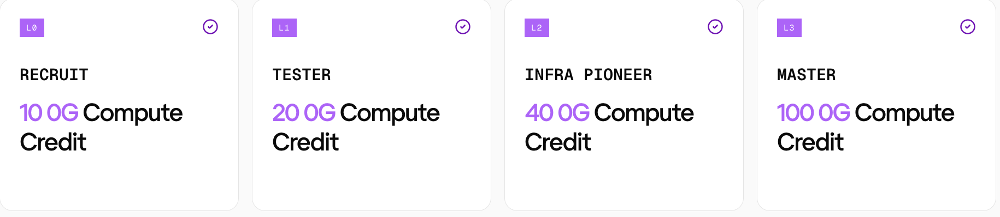

# 0g-testing-hub

**0g-testing-hub** is a testing program for 0G Ecosystem: submit the required feedback, test target apps, file reproducible bugs, and climb **L0-L3** for 0G Compute Credit. **Not a code project** - no build, test, or package manager here.

## Jump to

- [Levels & rewards](#levels--rewards)
- [Test targets](#test-targets)

## Levels & rewards

All rewards are **0G Compute Credit**; payout = the Credit of your **highest level reached** (not cumulative).

| Step | Reach | How it clears | Where to go | Credit |
|------|-------|---------------|-------------|:------:|
| **Sign up** | — | Register once: 0G wallet + GitHub username | [Testing intake](https://forms.gle/Mhm8YKXL9Kbvt11S8) | — |
| **1** | **L0** Recruit | Two feedback forms; no bug required | [0G Studio Feedback (App Suite, all four apps)](https://forms.gle/ymEdZrdTNs4giEm1A) · [0G Private Computer Feedback (every level)](https://forms.gle/G919xrbRyfVJxPZe8) | **10 0G Compute Credit** |
| **2** | **L1** Tester | 1 accepted · App Suite | [Defect report form](https://github.com/0gfoundation/0g-testing-hub/issues/new?template=defect-report.yml&labels=defect,status:filed) | **20 0G Compute Credit** |
| **3** | **L2** Infra Pioneer | +1 accepted · 0G Infra (2 total) | [Defect report form](https://github.com/0gfoundation/0g-testing-hub/issues/new?template=defect-report.yml&labels=defect,status:filed) | **40 0G Compute Credit** |
| **4** | **L3** Master | 5+ accepted · incl. 1 `systemic` | [Defect report form](https://github.com/0gfoundation/0g-testing-hub/issues/new?template=defect-report.yml&labels=defect,status:filed) | **100 0G Compute Credit** |

Track your filed issues on the [Defect board #19](https://github.com/orgs/0gfoundation/projects/19). The more **accepted, deduped** defects you surface, the higher you climb - Master is the cap.

**Won't be accepted / out of bounds:**

- **Duplicates** or **not-reproducible** "felt off" reports.
- **Feature requests** - unless the docs already promised the behavior.
- **P4 cosmetics** with no reproducible P1/P2.
- **Record-only dApp bugs** - route to the dApp's own channel; the Hub only logs coverage. If you log Ecosystem coverage here, include the dApp report URL when there is an actionable bug.
- **Funds / keys** - never sign or send; stop at the transaction-confirmation screen on swap / bridge / faucet / sign flows.

## Test targets

<!-- targets:start -->

### 0G App Suite · core (L0-L1)

- [**0G App**](https://app.0g.ai/) - flagship app builder, live on mainnet
- [**Genome**](https://dev.0g-vibe.pages.dev/genome) - paste a URL/screenshot, produces production-grade design DNA
- [**0G Chat**](https://dev.0g-vibe.pages.dev/private-chat) - end-to-end encrypted private chat (UI still WIP)
- [**PandaClaw**](https://dev.0g-vibe.pages.dev/agents) - agent launchpad + skill marketplace (Hermes + OpenClaw harness)

### 0G Infra · core (L2)

- [**0G Hub**](https://hub.0g.ai/) - bridge / swap / faucet / portfolio
- [**0G Storage Scan**](https://storagescan-newton.0g.ai/) - storage explorer
- [**Chain Scan**](https://chainscan.0g.ai/) - block explorer
- [**0G Code to Coin (0g-cc)**](https://www.npmjs.com/package/@0gfoundation/0g-cc)
  - Note: `0g-cc` is a CLI / MCP server, not a web app. Add it (`claude mcp add 0g-cc npx @0gfoundation/0g-cc`), then walk one inference / storage flow plus one error path. The funds/keys boundary still applies.

### 0G Ecosystem dApp

- [**TradeGPT**](https://tradegpt.finance/) - AI-driven DEX
- [**Jaine**](https://jaine.fi/) - DEX/liquidity (LIC)
- [**Oku**](https://oku.trade/) - concentrated liquidity DEX
- [**AI Arena**](https://aiarena.io/) - PvP, train AI agents
- [**CARV**](https://carv.io/) - gamer identity
- [**Cygnus Finance**](https://cygnus.finance/) - RWA stablecoin
- [**DataHive**](https://datahive.network/) - personal data economy
- [**Khalani**](https://hub.0g.ai/khalani/transfer?network=mainnet) - bridge to 0G
- [**Merkl**](https://app.merkl.xyz/) - claim LIC rewards

<!-- targets:end -->
