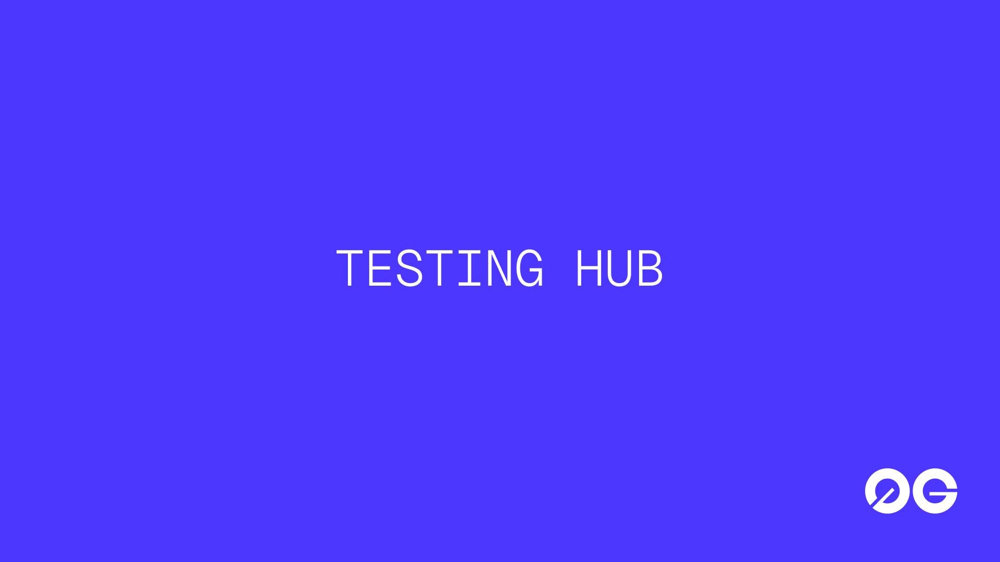

# 0G Testing Hub



A community-run exploratory QA platform for the **whole 0G ecosystem**. **Not a code project** — there is no source to read. The Hub runs in **seasons**; this repo is the evergreen home, headed for **build.0g.ai/test**.

> **Currently live: Season 1 · 2026 APAC cohort.** Season specifics (targets, reward amounts, dates, intake forms) live in [`seasons/2026-apac/`](./seasons/2026-apac/). The *how* — levels, defect rules, boundaries — is evergreen and lives here.

> **New here? Find your path:**
> - I'm a **tester** → [How it works](#how-it-works--climb-the-levels) · [Levels & rewards](#levels--rewards) · [Test targets](#test-targets)
> - I want my **dApp tested** → [Issue #2](https://github.com/0gfoundation/0g-testing-hub/issues/2)

## Why this exists (the goal)

Two outcomes, in priority order:

1. **Primary — real UX feedback on model calls (0G Compute).** The single most valuable output is honest, first-hand feedback from *actually running a model on 0G Compute*. It's wired into **every level** of the climb — everything else is secondary to this.
2. **Secondary — ecosystem product QA.** While you're in here, give the wider 0G product suite a health check and file **reproducible, routable defect intel**.

If an action doesn't serve one of these two, cut it.

## How it works — climb the levels

You don't sign up for a fixed tier. You **climb a ladder**. The funnel is wide at the bottom (anyone clears L0) and narrow at the top (L5 is leaderboard-gated). Beat one "monster," level up, and that **unlocks the next module** — *test more, extend outward*.

- **Core = L1 + L2** — 0G App Suite + 0G Infra, each delivering an accepted **Bug Report + Feedback**.
- **Extend outward** — L3 Ecosystem → L4 Hackathon → L5 full coverage.
- **Compute runs through every level** — every level also requires one **0G Private Computer Feedback**: *run a model on 0G Compute once, then submit it.* This is goal #1, so it's the spine, not a single rung.

Full mechanics and exact **pass conditions** are in [`LEVELS.md`](./LEVELS.md). Season 1's Credit amounts are in [`seasons/2026-apac/rewards.md`](./seasons/2026-apac/rewards.md).

### Levels & rewards

**All rewards are 0G Compute Credit** — no physical goods, no shipping. We collect a **wallet address (0G mainnet EVM)** to send Credit. **Payout = the Credit of the highest level you reach** (not cumulative); **badges accumulate.**

| Lv | Title | Gate — the "monster" (+ 0G Private Computer Feedback every level) | Unlocks | Credit (Season 1) |
|----|-----------|-------------------------------------------------------|---------|:-----------------:|
| **L0** | Recruit | Sign up + connect wallet, walk the **App Suite** happy path | → App Suite depth | **10** + entry badge |
| **L1** | Tester | **App Suite: accepted Bug Report + Feedback** *(core)* | → 0G Infra | **20** |
| **L2** | Infra Pioneer | **0G Infra: accepted Bug Report + Feedback** *(core)* | → Ecosystem | **40** |
| **L3** | Bug Hunter | **Ecosystem** breadth (record-only) + **≥3 accepted** total | → Hackathon | **60** |
| **L4** | Systemic Hunter | **Hackathon** breadth + one **`systemic`** finding | → leaderboard | **80** |
| **L5** | Master 👑 | **Cover every module** + season leaderboard top tier | — (cap) | **100** + limited Master identity |

> Badges are the level identity (the identity / equipment idea): Season 1 ships them as a claimable cosmetic role + leaderboard standing. Higher-tier perks (Credit multipliers, access) and any onchain form are open future directions, not commitments — see [`LEVELS.md`](./LEVELS.md#badges).

### What counts as a rewardable defect

Levels count **accepted, deduped** defects — not raw filings. Paying per filing would reward exactly the P3/P4 noise the [signal-to-noise gate](#feedback-calibration-pull-back-when-drifting) exists to suppress.

- **Accepted** — triage reproduced it and confirmed it's real (`status:accepted`). "Felt off" and not-reproducible reports don't count.
- **Deduped** — several reports sharing one root cause are **one** rewardable defect, credited to the first filer. Filing the same underlying issue across five apps is one credit, not five.
- A level that's all **P4 cosmetics** doesn't clear. File the lower (more severe) number when unsure and let triage adjust.

See [`.github/TRIAGE.md`](./.github/TRIAGE.md) for exactly how triage decides this.

## How to take part

Three stages — **1) get in → 2) do the work → 3) hand in.** Grab any link here; read the flow below for the order to use them in.

| Stage | Where to go |
|-------|-------------|
| **1 · Get in** | [Test sign-up](https://forms.gle/KFjtdnLNucAF8B2k7) (collects your 0G EVM wallet for Credit) |
| **2 · Do the work** | [Report a bug](https://github.com/0gfoundation/0g-testing-hub/issues/new?template=defect-report.yml) · [Defect board](https://github.com/users/lvxuan149/projects/1) · [0G Private Computer Feedback](https://forms.gle/TTxahPjziQskiJUC6) · [Test targets](#test-targets) |
| **3 · Hand in** | Your reward is **0G Compute Credit** — sent to the wallet address from sign-up. No shipping. |
| **Project owners** | [Submit your dApp — Issue #2](https://github.com/0gfoundation/0g-testing-hub/issues/2) |
| **Reference** | [0G Private Computer Getting Started Guide](https://www.notion.so/0g-labs/0G-Private-Computer-x-Opencode-x-CC-Switch-Complete-Getting-Started-Guide-Dragon888-374d6515e14380d8aad6e8fd424852ff?source=copy_link) |

> The deliverables that count are **reproducible, routable defect intel** (filed via the [Defect report form](https://github.com/0gfoundation/0g-testing-hub/issues/new?template=defect-report.yml)) plus **0G Private Computer Feedback** (every level). Every action below should serve those.

**Where things go depends on the deliverable, not on one catch-all inbox:**

- **Bugs in core 0G products (App Suite + Infra)** → filed *here* via the [Defect report form](https://github.com/0gfoundation/0g-testing-hub/issues/new?template=defect-report.yml). These are kept in the Hub because they **drive your Credit** (triage's `status:accepted`) and let us **spot systemic patterns across apps** (one root cause in many places). A team-owned form can't do either.
- **Feedback is owned by each project** → submit it in that team's own form (e.g. [0G Studio Feedback](https://forms.gle/inicY6BCbEgwxYQk8) for App Suite + Infra). Feedback is subjective and single-product, so the team that owns the product owns its intake.
- **Ecosystem & Hackathon dApps are record-only** → report their bugs to **the dApp's own channel** (their form / repo). The Hub only logs that you *walked* them for coverage; we don't escalate them as 0G defects.
- **[0G Private Computer Feedback](https://forms.gle/TTxahPjziQskiJUC6)** → required at **every level**, regardless of bucket. It's the program's #1 deliverable, so it sits on its own.
- **Project owners** asking to be tested → [Issue #2](https://github.com/0gfoundation/0g-testing-hub/issues/2), a separate intake.

### Where to submit — entry map

| Module | Bug report → | Feedback → |
|--------|--------------|------------|
| **0G App Suite** *(core)* | [Report a bug — Hub](https://github.com/0gfoundation/0g-testing-hub/issues/new?template=defect-report.yml) | [0G Studio Feedback](https://forms.gle/inicY6BCbEgwxYQk8) (team) |
| **0G Infra** *(core)* | [Report a bug — Hub](https://github.com/0gfoundation/0g-testing-hub/issues/new?template=defect-report.yml) | [0G Studio Feedback](https://forms.gle/inicY6BCbEgwxYQk8) (team) |
| **Ecosystem dApp** *(record-only)* | the dApp's own form / repo *(Hub logs coverage)* | the dApp's own form |
| **Hackathon dApp** *(record-only)* | the dApp's own form / repo *(Hub logs coverage)* | the dApp's own form |
| **Every level** | — | **[0G Private Computer Feedback](https://forms.gle/TTxahPjziQskiJUC6)** *(required at every level)* |

### Participation flow (testers) — climb the ladder

1. **Sign up** via the [Test sign-up form](https://forms.gle/KFjtdnLNucAF8B2k7) — it collects the 0G EVM wallet your Credit ships to. Rewards are tied to the deliverable, not to signing up.
2. **Clear L0:** walk an [App Suite](#0g-app-suite-prior-testinguser-facing) app's happy path, and **run a model on 0G Compute once + submit [0G Private Computer Feedback](https://forms.gle/TTxahPjziQskiJUC6)**. Every level repeats that step.
3. **Climb the core (L1–L2):** file accepted **Bug Reports + Feedback** on App Suite, then 0G Infra. This is the program's real value.
4. **Extend outward (L3–L5):** Ecosystem breadth → a `systemic` finding + Hackathon → full coverage + the leaderboard.
5. **File every defect** via the [Defect report form](https://github.com/0gfoundation/0g-testing-hub/issues/new?template=defect-report.yml), one issue per defect (see Submission flow). Your level is read off triage labels — see [`LEVELS.md` → Pass conditions](./LEVELS.md#pass-conditions).

> Are you a **project owner** who wants their dApp tested rather than a tester? Post it in [Issue #2 — Submit your 0G dApp for testing](https://github.com/0gfoundation/0g-testing-hub/issues/2) instead. (The bug form's "New issue" picker also links there.)

### Submission flow (bugs)

> This is the flow for **core 0G products (App Suite + Infra)**, which are filed in the Hub. For **record-only** Ecosystem / Hackathon dApps, report bugs to **the dApp's own channel** and just log that you walked it — see the [entry map](#where-to-submit--entry-map).

1. **Reproduce it first.** A defect only counts if someone else can follow your steps and see the same result. "Felt off" is not a defect.
2. **Tag ownership and severity.** Ownership = App Suite / 0G Infra / Ecosystem dApp / Hackathon dApp; severity = P1–P4 per [`defects/SEVERITY.md`](./defects/SEVERITY.md). Unsure between two levels → file the lower number (more severe) and let triage downgrade.
3. **File via the [Defect report form](https://github.com/0gfoundation/0g-testing-hub/issues/new?template=defect-report.yml)** (one issue per bug). The form's fields are the defect template — also mirrored [below](#defect-filing-template-mandatory-for-every-defect) and in [`defects/TEMPLATE.md`](./defects/TEMPLATE.md). **If you suspect this bug shares a cause with another** (e.g. the same missing Chain ID across apps), give both the same **root-cause code** in that field — triage collapses them into one systemic finding (and one reward credit) instead of N separate tickets.
4. **Respect the hard boundaries.** Never touch funds or keys — stop at the transaction-confirmation screen on swap / bridge / faucet / sign flows. No feature requests.
5. **It lands on the board automatically, then we triage and route.** A new issue auto-adds to the board's **Triage** column; we then apply `area:` / `sev:` / `status:` labels, dedupe repeated root causes (same `rc:` code) into a single systemic finding, and route it upstream once — see [`.github/TRIAGE.md`](./.github/TRIAGE.md) and [Feedback calibration](#feedback-calibration-pull-back-when-drifting).

## Task endpoint (three progressive end states; not done until T3)

- **T1 — Coverage achieved**: For every app in scope, walk the core flow at least once on the happy path + once on an error path. No blind spots.
- **T2 — Defect filed**: Every finding goes in via the [Defect report form](https://github.com/0gfoundation/0g-testing-hub/issues/new?template=defect-report.yml); it only counts once triage **accepts** it as reproducible. "Felt off" is not a defect.
- **T3 — Intel routed**: Each defect carries an `area:` ownership label (App Suite / 0G Infra / Ecosystem / Hackathon) and reaches `status:routed` on the board. Reaching **Routed** is the bar for "done"; `Closed` is the later resting state once upstream resolves, rejects, or dedupes it.

Two state machines run in parallel. **Per app** (coverage), each target is a node:

```
Not started → Happy path OK → Error path in progress → Defect found (filed) → Routed / Closed
```

**Per defect** (the board), each issue moves through columns mirrored by its `status:` label:

```
Triage (status:filed) → Accepted → Routed → Closed
```

A node's initial baseline must absorb the **known stack state** — do not judge defects against "how production should look," or you'll generate a flood of false positives.

## What a good run looks like

T1–T3 say when *one* tester is done; this is when the *season* succeeds. Read in priority order — these targets are organizer-facing and mirror the two goals up top.

**Depth before breadth.** The primary win is depth on 0G Compute (actually run a model, give detailed first-hand feedback) — not skimming. For everything else, breadth is a *floor*: cover each first-party app once. Don't chase ecosystem/Hackathon breadth or P4 volume — that's what the [SNR gate](#feedback-calibration-pull-back-when-drifting) and record-only rule are for.

| # | What we measure | Target (this season) | Why |
|---|-----------------|----------------------|-----|
| **① 0G Private Computer Feedback** *(primary)* | Submissions backed by a **real model call** | **≥ 30** | The single highest-value output; required at every level. |
| **② Coverage** *(floor)* | First-party apps walked happy + error path — **App Suite** (0G App, Genome, 0G Chat, PandaClaw) | **100%** (0G Infra: as far as you get) | T1. No blind spots on the apps that are 0G's account. |
| **③ Defect quality** *(secondary)* | **accepted, deduped** defects · routed upstream · systemic findings | **~15 accepted** · **≥ 80% routed** · **≥ 1 systemic** | Anchored on accepted + routed + deduped — not raw filings (matches the reward rule). |
| **④ Health** *(guardrail)* | Acceptance rate (`accepted ÷ filed`) | **≥ 50%** | Low acceptance = noise creeping in; the metric itself discourages volume-chasing. |

A run that hits ① and ② but files only a handful of high-signal defects is a **success**. A run with hundreds of P4 filings and thin 0G Private Computer Feedback is **not** — even if the raw count looks big.

## Hard boundaries (these paths are off-limits)

- **No feature requests.** "It'd be nice to have feature X" gets cut. Exception: existing functionality missing something the documentation already promised → that's a bug.
- **Never touch funds/keys.** For swap / bridge / faucet and any step involving real assets or private-key signing, stop at the "transaction confirmation" screen — do not sign, do not send.
- **Ecosystem & Hackathon dApps are record-only.** Bugs in TradeGPT / Jaine / Oku / etc. are not on 0G's account — just log them.

> **Wording (not a red line, just house style):** use "The Blockchain for AI Agents" and "onchain" (no hyphen); avoid legacy names. Getting this wrong is a copy nit, not a boundary violation.

## Test targets

> The wall below is **Season 1's** target set, in unlock order (core → extend outward). Pull URLs from here, not from memory. Each carries its routing bucket.

### 0G App Suite ( Prior testing，user-facing) · core, L0–L1

*Focus: onboarding, wallet connect, and the main user journey end to end. The richest bugs hide in **repeat-user behavior** — stale-session re-entry, captcha/token-expiry resubmits, reusing one wallet across apps, mid-flow Chain ID switches, refresh/back-button interrupts.*

- **0G App** — flagship app builder, live on mainnet → https://app.0g.ai/
- **Genome** — paste a URL/screenshot, produces production-grade design DNA → https://dev.0g-vibe.pages.dev/genome
- **0G Chat** — end-to-end encrypted private chat (UI still WIP) → https://dev.0g-vibe.pages.dev/private-chat
- **PandaClaw** — agent launchpad + skill marketplace (Hermes + OpenClaw harness) → https://dev.0g-vibe.pages.dev/agents

### 0G Infra （Prior testing，developer-facing）· core, L2

*Focus: correctness, not polish — bridge / swap / faucet flows (stop at the confirm screen), explorer data accuracy (balances, tx, storage roots), RPC / Chain ID handling, and 0g-cc's inference + storage paths.*

- **0G Hub** — bridge / swap / faucet / portfolio → https://hub.0g.ai/
- **0G Storage Scan** → https://storagescan-newton.0g.ai/
- **Chain Scan** — block explorer → https://chainscan.0g.ai/
- **0G Code to Coin (0g-cc)** — official MCP server routing AI inference / fine-tuning / storage to 0G Compute (used from Claude Code / Cursor / Windsurf) → `npm install @0gfoundation/0g-cc` · [npm](https://www.npmjs.com/package/@0gfoundation/0g-cc)

> **0g-cc is a CLI / MCP server, not a web app — test it differently:** install it, add it as an MCP server (`claude mcp add 0g-cc npx @0gfoundation/0g-cc`), then walk an inference / storage flow plus one error path (bad key, no funds, network down). Because it **routes calls to 0G Compute directly, testing it doubles as your [0G Private Computer Feedback](https://forms.gle/TTxahPjziQskiJUC6).** It has wallet + VIBEZ token flows — the funds/keys boundary applies: stop before signing, sending, or launching/trading a token.

### Ecosystem dApps (live on 0G, user-facing) · extend, L3 — record-only

*Focus (record-only): confirm it loads and connects a wallet on 0G, walk the main flow once, log obvious breakage — don't deep-dive. Bugs here are logged, not on 0G's account.*

- **TradeGPT** — AI-driven DEX → https://tradegpt.finance/
- **Jaine** — DEX/liquidity (LIC) → https://jaine.fi/
- **Oku** — concentrated liquidity DEX → https://oku.trade/
- **AI Arena** — PvP, train AI agents → https://aiarena.io/
- **CARV** — gamer identity → https://carv.io/
- **Cygnus Finance** — RWA stablecoin → https://cygnus.finance/
- **DataHive** — personal data economy → https://datahive.network/
- **Khalani** — bridge to 0G → https://hub.0g.ai/khalani/transfer?network=mainnet
- **Merkl** — claim LIC rewards → https://app.merkl.xyz/

### Hackathon dApps (live on 0G, user-facing) · extend, L4–L5 — record-only

*Focus (record-only): same as Ecosystem — does it load, connect, and run its core flow on 0G? Log what's clearly broken; no deep-dive.*

- 0g-kit: TypeScript toolkit for 0G — https://www.0gkit.com/
- Blindmarket: Privacy-preserving task marketplace on 0G — https://www.blindmarket.xyz/

## Defect-filing template (mandatory for every defect)

```
Title:
Ownership: App Suite | 0G Infra | Ecosystem dApps | Hackathon dApps (note which product)
Severity: P1 / P2 / P3 / P4
Environment: browser / wallet / Chain ID / network
Repro steps: 1. 2. 3. …
Expected result:
Actual result:
Screenshot/recording:
Root-cause guess (optional):
```

> You don't fill this in by hand — the [Defect report form](https://github.com/0gfoundation/0g-testing-hub/issues/new?template=defect-report.yml) collects exactly these fields, so the intel is structured at intake. The template is reproduced here as the canonical field list. For the severity scale see [`SEVERITY.md`](./defects/SEVERITY.md); [`defects/`](./defects/) holds worked examples.

## Feedback calibration (pull back when drifting)

- **Signal-to-noise gate**: a round that's all P3/P4 trivia with no reproducible P1/P2 → you're nitpicking; pull back to core flows.
- **Aggregate repeated patterns**: when the same root cause recurs across multiple apps (e.g. Chain ID 16661 missing from a mapping table, captcha token expiry causing UI contradictions) → give every issue the same `rc:<CODE>` label, escalate from "N defects" to **one** `systemic` issue, and route it upstream (SDK / docs / config) instead of filing per-app. This is also what makes those N reports **one** rewardable defect — see [What counts](#what-counts-as-a-rewardable-defect).
