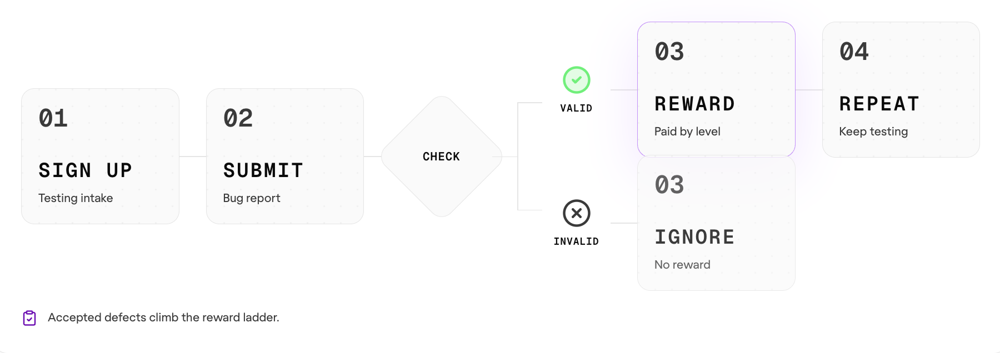
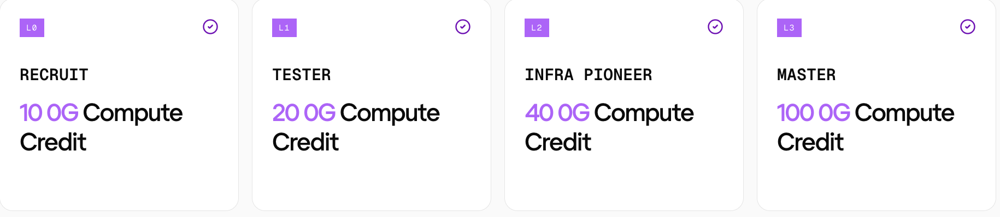

# 0g-testing-hub

**0g-testing-hub** is a testing program for 0G Ecosystem: complete the required L0 surveys, test target apps, file reproducible bugs through Submit Feedback, and climb **L0-L3** for 0G Compute Credit. **Not a code project** - no build, test, or package manager here.

## Jump to

- [Test, Report, Reward](#test-report-reward)
- [Tester Path](#tester-path)
- [Test Targets](#test-targets)

## Test, Report, Reward

All rewards are **0G Compute Credit**; payout = the Credit of your **highest level reached** (not cumulative).

| Reach | How it clears | Where to go | Credit |
|-------|---------------|-------------|:------:|
| **Sign Up** | Register with your 0G mainnet wallet (your GitHub account is your identity) | [Sign up (GitHub)][signup-link] | — |
| **L0** Recruit | 2 required surveys; no bug required | 1. [0G Studio Survey (App Suite, all four apps)](https://forms.gle/ymEdZrdTNs4giEm1A) 2. [0G Private Computer Survey](https://forms.gle/G919xrbRyfVJxPZe8) | **10 0G Compute Credit** |
| **L1** Tester | 1 accepted · App Suite | [Submit Feedback form](https://github.com/0gfoundation/0g-testing-hub/issues/new?template=submit-feedback.yml) | **20 0G Compute Credit** |
| **L2** Infra Pioneer | +1 accepted · 0G Infra (2 total) | [Submit Feedback form](https://github.com/0gfoundation/0g-testing-hub/issues/new?template=submit-feedback.yml) | **40 0G Compute Credit** |
| **L3** Master | 5+ accepted · App Suite + 0G Infra | [Submit Feedback form](https://github.com/0gfoundation/0g-testing-hub/issues/new?template=submit-feedback.yml) | **100 0G Compute Credit** |

## Tester Path

1. **[Sign up][signup-link]** once with your public 0G mainnet wallet. Keep the default title; the issue is your tracker.
2. **Clear L0** by completing both surveys in the table above. No bug is required for L0.
3. **Test core targets first:** 0G App Suite for L1, then 0G Infra for L2/L3. Ecosystem dApps are useful coverage, but not core reward gates.
4. **Submit one item at a time** with [Submit Feedback](https://github.com/0gfoundation/0g-testing-hub/issues/new?template=submit-feedback.yml). For bugs, include steps, expected result, actual result, and evidence. Then wait for maintainer triage.

Before filing, [search existing reports](https://github.com/0gfoundation/0g-testing-hub/issues?q=is%3Aissue%20label%3Afeedback). Duplicates credit the first reporter.

**Reward notes / out of bounds:**

- **Duplicates** or **not-reproducible** "felt off" reports.
- **Feature requests** - welcome under Category `Feature Request`, but recorded only, never rewarded (unless the docs already promised the behavior — then it's a bug).
- **Cosmetic-only reports** with no reproducible functional impact.
- **Ecosystem dApps** - welcome as ecosystem coverage, but prioritize 0G App Suite and 0G Infra if you are aiming for higher rewards. Also report actionable dApp bugs to the dApp's own channel and paste the link as a comment.
- **Funds / keys** - never sign or send; stop at the transaction-confirmation screen on swap / bridge / faucet / sign flows.

## Test Targets

<!-- targets:start -->

Test the core user flow for each target, including one happy path and one error path. File reproducible DX friction: confusing setup, unclear errors, broken docs, wallet/network issues, blocked flows, or behavior that diverges from what the product promises.

### 0G App Suite · core (L0-L1)

- [**0G App**](https://app.0g.ai/) - flagship app builder, live on mainnet
- [**Genome**](https://app.0g.ai/genome) - paste a URL/screenshot, produces production-grade design DNA
- [**0G Chat**](https://app.0g.ai/private-chat) - end-to-end encrypted private chat (UI still WIP)
- [**Agent launchpad**](https://app.0g.ai/agent-launchpad) - agent launchpad + skill marketplace (Hermes + OpenClaw harness)

### 0G Infra · core (L2)

- [**0G Hub**](https://hub.0g.ai/) - bridge / swap / faucet / portfolio
- [**0G Storage Scan**](https://storagescan-newton.0g.ai/) - storage explorer
- [**Chain Scan**](https://chainscan.0g.ai/) - block explorer
- [**0G Code to Coin (0g-cc)**](https://www.npmjs.com/package/@0gfoundation/0g-cc) - MCP server for AI inference / storage on 0G Compute
  - Note: `0g-cc` is a CLI / MCP server, not a web app. Add it (`claude mcp add 0g-cc npx @0gfoundation/0g-cc`), then walk one inference / storage flow plus one error path. The funds/keys boundary still applies.

### 0G Ecosystem dApp

- [**Zia**](https://tradegpt.finance/) - natural language DEX on 0G
- [**Jaine**](https://jaine.fi/) - DEX/liquidity (LIC)
- [**Oku**](https://oku.trade/) - concentrated liquidity DEX
- [**AI Arena**](https://aiarena.io/) - PvP, train AI agents
- [**CARV**](https://carv.io/) - gamer identity
- [**Cygnus Finance**](https://cygnus.finance/) - RWA stablecoin
- [**DataHive**](https://datahive.network/) - personal data economy

<!-- targets:end -->

[signup-link]: https://github.com/0gfoundation/0g-testing-hub/issues/new?title=%5Bsignup%5D%3A%20tester%20registration&labels=signup&body=%23%23%23%200G%20mainnet%20EVM%20wallet%20address%0A%0AReplace%20this%20line%20with%20your%20public%200x%20wallet%20address.%0A%0ADo%20not%20paste%20a%20private%20key%2C%20seed%20phrase%2C%20or%20any%20secret.%0A%0A---%0A%0A%2A%2AThis%20issue%20is%20your%20one-time%20registration%20and%20permanent%20reward%20tracker.%2A%2A%20Leave%20the%20title%20as%20is%20%E2%80%94%20a%20bot%20renames%20it%20to%20your%20GitHub%20username.%0A%0A%23%23%23%20Your%20steps%20%E2%80%94%20tick%20each%20box%20as%20you%20finish%20it%0A%0A-%20%5B%20%5D%20Replaced%20the%20placeholder%20above%20with%20my%20public%200x%20wallet%2C%20then%20pressed%20%2A%2ACreate%2A%2A%0A-%20%5B%20%5D%20Completed%20the%20%5B0G%20Studio%20Survey%5D%28https%3A%2F%2Fforms.gle%2FymEdZrdTNs4giEm1A%29%2C%20entering%20my%20GitHub%20username%20%2A%2Aexactly%20as%20it%20appears%20as%20this%20issue%27s%20author%2A%2A%0A-%20%5B%20%5D%20Completed%20the%20%5B0G%20Private%20Computer%20Survey%5D%28https%3A%2F%2Fforms.gle%2FG919xrbRyfVJxPZe8%29%2C%20using%20that%20same%20GitHub%20username%0A%0A%23%23%23%20What%20the%20bot%20does%20%E2%80%94%20these%20arrive%20as%20labels%20and%20comments%20here%2C%20nothing%20for%20you%20to%20tick%0A%0A%7C%20You%27ll%20see%20%7C%20What%20it%20means%20%7C%20When%20%7C%0A%7C---%7C---%7C---%7C%0A%7C%20a%20%E2%9C%85%20comment%20%7C%20wallet%20accepted%20%E2%80%94%20you%27re%20registered%20%7C%20within%20a%20minute%20%7C%0A%7C%20%60signup%3Aneeds-fix%60%20%7C%20wallet%20unreadable%20%E2%80%94%20edit%20this%20issue%20to%20fix%20it%20%7C%20within%20a%20minute%20%7C%0A%7C%20%60l0%3Astudio-done%60%20%2F%20%60l0%3Apc-done%60%20%7C%20that%20survey%20reached%20us%20%7C%20minutes%20after%20you%20submit%20it%20%7C%0A%7C%20%60l0%3Acleared%60%20%7C%20both%20surveys%20in%20%E2%80%94%20%2A%2AL0%20done%2C%2010%20Credit%2A%2A%20%7C%20once%20both%20have%20arrived%20%7C%0A%0AStill%20nothing%20after%20a%20couple%20of%20days%3F%20The%20most%20common%20cause%20is%20a%20GitHub%20username%20in%20the%20survey%20that%20does%20not%20match%20this%20issue%27s%20author.%20Comment%20here%20and%20we%27ll%20sort%20it%20out.%0A%0AAfter%20L0%2C%20file%20reproducible%20App%20Suite%20bugs%20with%20%5BSubmit%20Feedback%5D%28https%3A%2F%2Fgithub.com%2F0gfoundation%2F0g-testing-hub%2Fissues%2Fnew%3Ftemplate%3Dsubmit-feedback.yml%29%20to%20climb%20toward%20%2A%2AL1%20%2820%20Credit%29%2A%2A.
