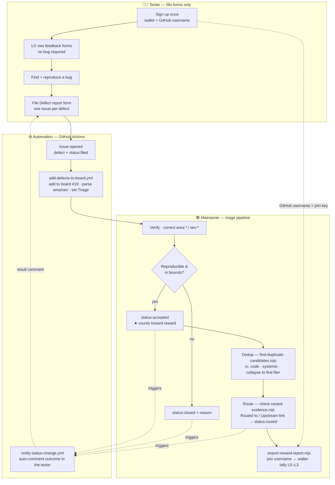
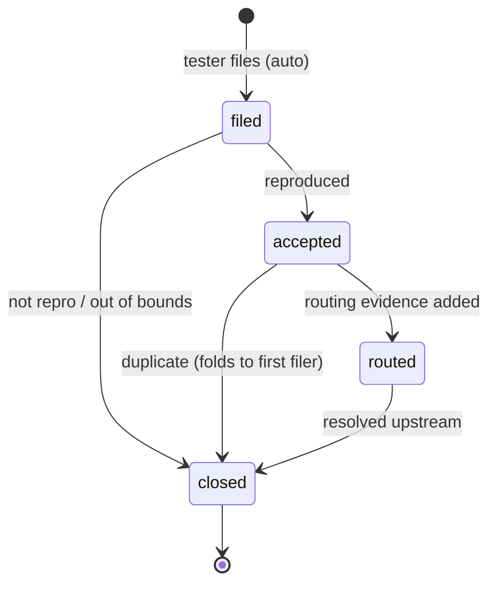

# Workflows — tester & maintainer

How a defect travels from a tester's form to a payout row. Two actors, one automation
layer between them. This is the visual companion to [`.github/TRIAGE.md`](../.github/TRIAGE.md)
(the maintainer runbook) and [`LEVELS.md`](../LEVELS.md) (the reward ladder).

- **Tester** only ever fills forms — never touches labels, the board, or `defects/*.md`.
- **Automation** (GitHub Actions) labels, boards, and closes the feedback loop.
- **Maintainer** runs the label → verify → dedup → route → export pipeline.

## End-to-end flow

## Status state machine → board columns

The reward count reads off these labels. `status:accepted` is the state that counts.

| Status label | Board column | Rewardable? |
|---|---|:---:|
| `status:filed` | Triage | no (unvalidated) |
| `status:accepted` | Accepted | **yes** |
| `status:routed` | Routed | **yes** |
| `status:closed` | Closed | no |

## Reward ladder (what the export computes)

Payout = Credit of the **highest level reached**. Counts **accepted + deduped** core
(App Suite / 0G Infra) findings; Ecosystem coverage logs are excluded. Full rules in
[`LEVELS.md`](../LEVELS.md).

| Lv | Clears with | Credit |
|----|-------------|:---:|
| **L0** Recruit | two feedback forms; no bug | 10 |
| **L1** Tester | 1 accepted · App Suite | 20 |
| **L2** Infra Pioneer | 2 accepted · App Suite + 0G Infra | 40 |
| **L3** Master | 5+ accepted · incl. 1 `systemic` | 100 |

## Two things the automation gets right (and recently fixed)

- **Triage progress is not clobbered.** `add-defects-to-board.yml` runs only on issue
  *open* or when the `defect` label is added — not on every later label change — so moving
  an issue to `status:accepted` no longer gets reset back to Triage.
- **The accept comment tells the truth per area.** `notify-status-change.yml` branches the
  message: App Suite accept counts; an **0G Infra** accept alone does **not** clear L1
  (needs a paired App Suite bug → L2); an **Ecosystem** coverage log is record-only and
  does **not** count.

Open items that are policy/data decisions, not code: see [`KNOWN-GAPS.md`](../KNOWN-GAPS.md).
