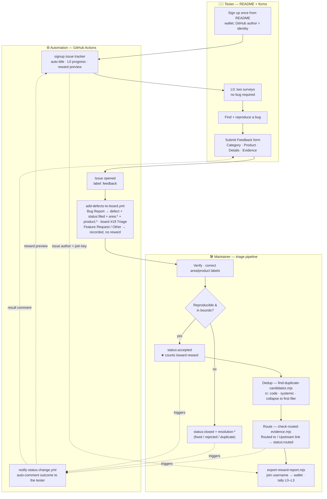
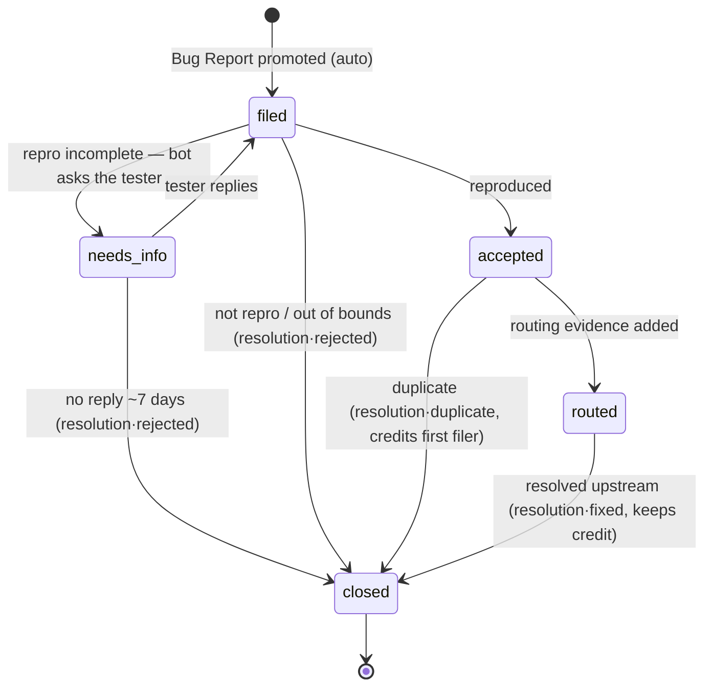

# Workflows — tester & maintainer

How a defect travels from a tester's form to a payout row. Two actors, one automation
layer between them. This is the visual companion to [`.github/TRIAGE.md`](../.github/TRIAGE.md)
(the maintainer runbook) and [`LEVELS.md`](./LEVELS.md) (the reward ladder).

- **Tester** uses the README registration link, L0 surveys, and the Submit Feedback form — never labels, the board, or `defects/*.md`.
- **Automation** (GitHub Actions) labels, boards, updates the signup tracker, and closes the feedback loop.
- **Maintainer** runs the label → verify → dedup → route → export pipeline.

## End-to-end flow

```mermaid
flowchart TD
    subgraph T["🧑‍💻 Tester — README + forms"]
      T1["Sign up once from README<br/>wallet; GitHub author = identity"]
      T2["L0: two surveys<br/>no bug required"]
      T3["Find + reproduce a bug"]
      T4["Submit Feedback form<br/>Category · Product · Details · Evidence"]
    end

    subgraph A["⚙️ Automation — GitHub Actions"]
      A0["signup issue tracker<br/>auto-title · L0 progress · reward preview"]
      A1["Issue opened<br/>label: feedback"]
      A2["add-defects-to-board.yml<br/>Bug Report → defect + status:filed + area:* + product:* · board #19 Triage<br/>Feature Request / Other → recorded, no reward"]
      A3["notify-status-change.yml<br/>auto-comment outcome to the tester"]
    end

    subgraph M["🛠️ Maintainer — triage pipeline"]
      M1["Verify · correct area/product labels"]
      M2{"Reproducible &<br/>in bounds?"}
      M3["status:accepted<br/>★ counts toward reward"]
      M4["status:closed + resolution:*<br/>(fixed / rejected / duplicate)"]
      M5["Dedup — find-duplicate-candidates.mjs<br/>rc: code · systemic · collapse to first filer"]
      M6["Route — check-routed-evidence.mjs<br/>Routed to / Upstream link → status:routed"]
      M7["export-reward-report.mjs<br/>join username → wallet · tally L0–L3"]
    end

    T1 --> A0 --> T2 --> T3 --> T4 --> A1 --> A2 --> M1 --> M2
    M2 -- yes --> M3 --> M5 --> M6 --> M7
    M2 -- no --> M4
    M3 -. triggers .-> A3
    M4 -. triggers .-> A3
    M6 -. triggers .-> A3
    A3 -. result comment .-> T4
    A3 -. reward preview .-> A0
    A0 -. "issue author = join key" .-> M7
```

## Status state machine → board columns

The reward count reads off these labels. `status:accepted` is the state that counts.

Only `Bug Report` submissions enter this state machine — `Feature Request` / `Other`
stay plain feedback with no `status:*` at all. Rewards still come only from
**accepted, deduped core bugs** (App Suite / 0G Infra).

```mermaid
stateDiagram-v2
    [*] --> filed: Bug Report promoted (auto)
    filed --> needs_info: repro incomplete — bot asks the tester
    needs_info --> filed: tester replies
    needs_info --> closed: no reply ~7 days (resolution·rejected)
    filed --> accepted: reproduced
    filed --> closed: not repro / out of bounds (resolution·rejected)
    accepted --> routed: routing evidence added
    accepted --> closed: duplicate (resolution·duplicate, credits first filer)
    routed --> closed: resolved upstream (resolution·fixed, keeps credit)
    closed --> [*]
```

Every close carries exactly one `resolution:*` label — that label (and the bot comment
it triggers) is how the tester learns whether the report counted.

| Status label | Board column | Rewardable? |
|---|---|:---:|
| `status:filed` | Triage | no (unvalidated) |
| `status:needs-info` | Needs Info | no — waiting on the tester |
| `status:accepted` | Accepted | **yes** |
| `status:routed` | Routed | **yes** |
| `status:closed` + `resolution:fixed` | Closed | **yes** — a fixed defect keeps its credit |
| `status:closed` + `resolution:rejected` / `resolution:duplicate` | Closed | no (duplicates credit the first filer) |

## Reward ladder (what the export computes)

Payout = Credit of the **highest level reached**. Counts **accepted + deduped** core
(App Suite / 0G Infra) findings; Ecosystem coverage logs are valuable but excluded from core reward tiers. The L0–L3 table
and pass conditions are the evergreen spec in [`LEVELS.md`](./LEVELS.md), mirrored on the
[landing page](../README.md#test-report-reward) — not repeated here so the numbers can't drift.

## Two things the automation gets right (and recently fixed)

- **Triage progress is not clobbered.** `add-defects-to-board.yml` runs on issue
  *open*, `feedback` / `defect` intake labels, and `status:*` transitions — not on
  unrelated later labels like `area:*`, `product:*`, or `rc:*`. Moving an issue to
  `status:needs-info`, `status:accepted`, `status:routed`, or `status:closed` syncs
  the board without resetting it back to Triage.
- **The accept comment tells the truth per area.** `notify-status-change.yml` branches the
  message: App Suite accept counts; an **0G Infra** accept alone does **not** clear L1
  (needs a paired App Suite bug → L2); an **Ecosystem** coverage log helps follow-up
  but does **not** count toward the core reward ladder.
- **The signup issue is the tester's tracker.** The README registration link creates it,
  signup confirmation normalizes the title from the issue author, L0 survey automation comments partial / cleared states, and
  accepted or routed core defects add an advisory reward progress preview. Final payout
  still comes from `export-reward-report.mjs`.

Open items that are policy/data decisions, not code, should be tracked in the maintainers' local planning notes or promoted into a public issue when they need external coordination.
